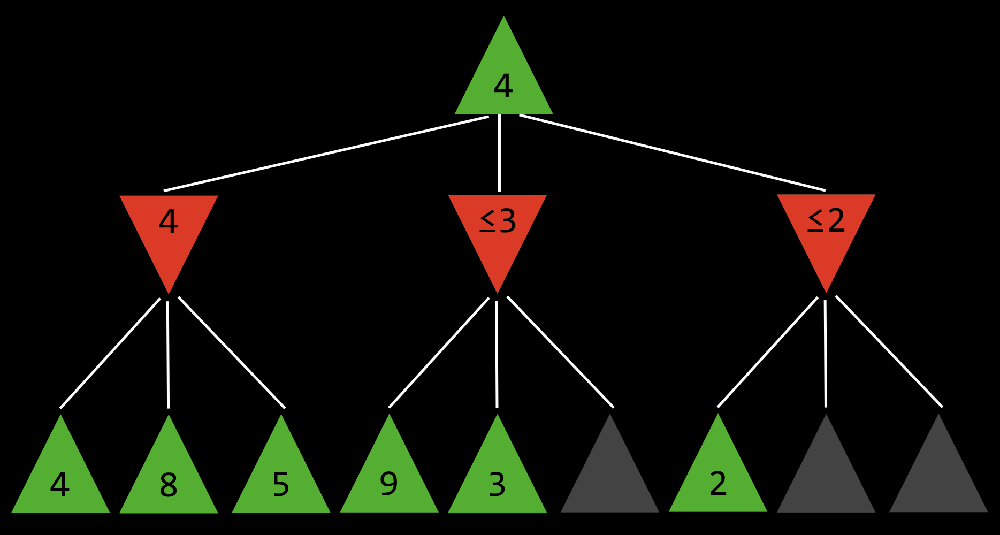

# 0: Search

## Terminology

- Agent: entity that perceives its environment and acts upon that environment
    - e.g. 15puzzle: agent is person/AI to solve that puzzle
- State: a configuration of the agent and its environment
    - different state, different solutions required
- Initial State: the state in which the agent begins
- Actions: choices that can be made in a state
    - $ACTIONS(s)$ returns the set of actions that can be executed in state $s$
    - some actions may be valid in some states but not in other states
- Transition Model: a description of what state results from performing any applicable action in any state
    - $RESULT(s,a)$ returns the state resulting from performing action $a$ in state $s$
- State Space: the set of all states reachable from the initial state by any sequence of actions
- Goal Test: way to determine whether a given state is a goal state
- Path Cost: numerical cost associated with a given path

## Search Problems...

- has initial state
- has actions
- has transition model
- need goal test
- need path cost function
- Solution: a sequence of actions that leads from the initial state to a goal state
- **Optimal** solution: solution that has the lowest path cost among all solutions

### Node

a data structure that keeps track of...

- a state
- a parent (node that generated this node)
- an action (action applied to parent to get node)
- a path cost (from initial state to node)

## Approach

- Start with a frontier that contains the initial state.
- Repeat:
    - If the frontier is empty, then no solution.
    - Remove a node from the frontier.
    - If node contains goal state, return the solution.
    - Expand node, add resulting nodes to the frontier.
    (consider all possible next nodes to get to, and go to Repeat)
- What could go wrong?
    - may get into infinite loop
        - Solution: keep track

## Revised Approach

- Start with a frontier that contains the inifial state.
- Start with an empty explored set.
- Repeat:
    - If the frontier is empty: then no solution.
    - Remove a node from the frontier.
    - If node contains goal state, return the solution.
    - Add the ndoe to the explored set.
    - Expand node,
    Add resulting nodes to the frontier **if they aren’t already in the frontier or the explored set.**

## DFS and BFS: Which data structure for the frontier?

- **Depth-First Search(DFS):**
search algorithm that always expands the **deepest** node in the frontier
    - use Stack: last-in first-out data type
    - will find solution if the space is finite
    - memory saving
    - might end up not finding the best solution
- **Breadth-First Search(BFS):**
search algorithm that always expands the **shallowest** node in the frontier
    - use Queue: first-in first-out data type
    - finds the optimal path
    - need to explore a lot of states in order to find optimal path

## Informed Search

- Uninformed Search
    - search strategy that uses no problem-specific knowledge
    - DFS and BFS
- Informed Search
    - search strategy that uses problem-specific knowledge to find solutions more efficiently
- **Greedy Best-First Search(GBFS):**
search algorithm that expands the node that is closest to the goal, as estimated by a heuristic function $h(n)$
    - Heuristic function?
        - estimation function: isn’t a guarantee
        - use Manhattan Distance: x distance + y distance
    - explore the smallest $h(n)$ valued node
    - needs good heuristic
    - may not find the optimal, even with good heuristics
- **A* Search:**
search algorithm that expands node with lowest value of  $g(n) + h(n)$
    - $g(n)$ = cost to reach node
    - $h(n)$ = heuristic function (estimated cost to goal)
    - is optimal solution **IF**
        - $h(n)$ is admissible (never overestimates the true cost: underestimating is ok)
        - $h(n)$ is consistent 
        (for every node $n$ and successor $n'$ with step cost $c$, $h(n)\le h(n') + c$ )
    - heuristic finding is important

## Adversarial Search

I’m finding the solution, and some other agent fights against me.

- Tic-Tac-Toe
    - X win: +1, tie: 0, X lose: -1
    - X as Max player, O as Min player
    → Max player wants bigger value, Min player wants smaller value
- Game
    - $S_0$ : initial state
    - $PLAYER(s)$: returns which player to move in state $s$
    - $ACTIONS(s)$: returns legal moves in state $s$
    - $RESULT(s, a)$: returns state after action $a$ taken in state $s$
    - $TERMINAL(s)$: checks if state $s$ is a terminal state
    - $UTILITY(s)$: final numerical value for terminal state $s$
- **MINIMAX Algorithm**
    - Given a state s:
        - $MAX$ picks action $a$ in $ACTIONS(s)$ that produces highest value of $MIN-VALUE(RESULT(s,a))$
        - $MIN$ picks action $a$ in $ACTIONS(s)$ that produces smallest value of $MAX-VALUE(RESULT(s,a))$
    - function $MAX-VALUE(state)$:
        - if $TERMINAL(state):$
            - return $UTILITY(state)$
        - $v = - \infin$
        - for $action$ in $ACTIONS(state)$:
            - $v = MAX(v, MIN-VALUE(RESULT(state, action)))$
        - return $v$
    - function $MIN-VALUE(state)$
        - if $TERMINAL(state):$
            - return $UTILITY(state)$
        - $v = \infin$
        - for $action$ in $ACTIONS(state)$:
            - $v = MIN(v, MAX-VALUE(RESULT(state, action)))$
        - return $v$
- Optimizations
    - Alpha-Beta Pruning
        
        
        

- **Depth-Limited Minimax**
    - 특정 깊이까지만 탐색이 이루어지는 Minimax
    - **Evaluation Function:** 
    function that estimates the expected utility of the game from a given state
    - the better the evaluation function is, the better AI plays